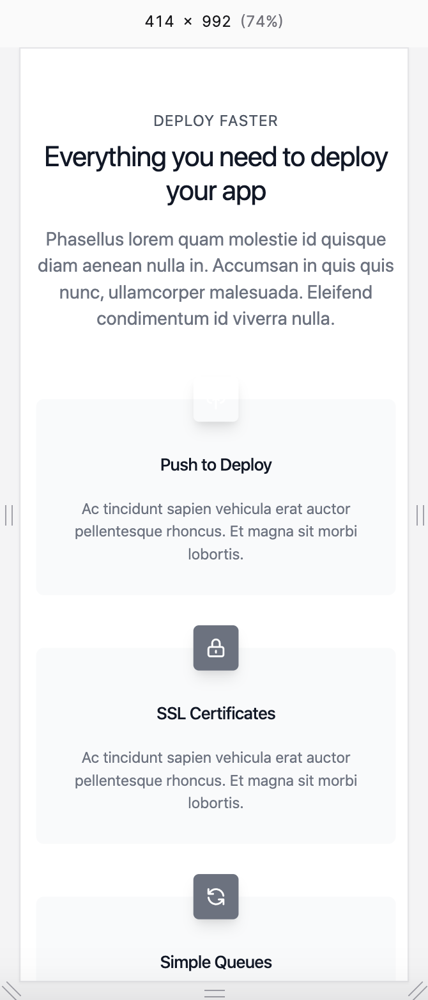
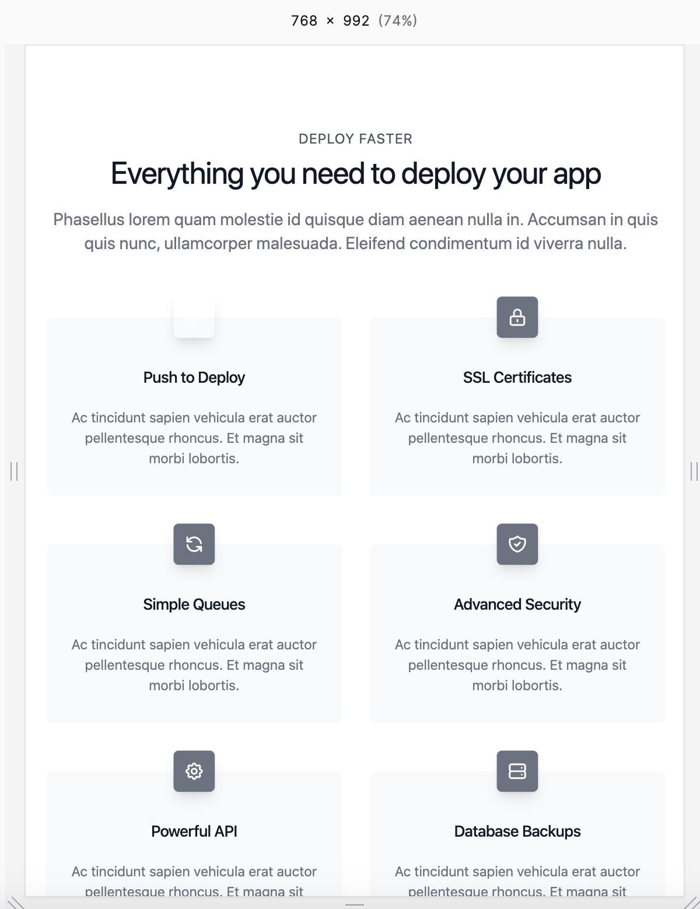
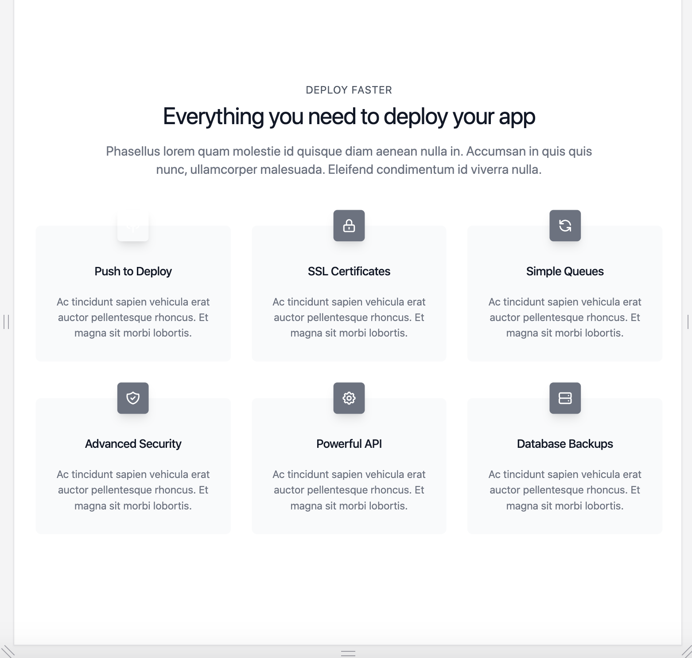

# ejercicio minimalista

## intro
Este es un tipico componente que trabajamos todo el tiempo. Un headline con su bajada y una grilla con items a resaltar.

Debajo los mockups que nos entrega el equipo de diseño, que luego transformamos en templates, componentes, etc.

### Small Size Viewport

### Medium Size Viewport

### Large / Larger / Wide Size Viewport

## entregable

👍 Al ser ejemplos en JPG no es necesario que el entregable sea pixel perfect ni respetar colores o tipografias, pero si, seria ideal que mantenga mas o menos las proporciones entre los elementos.

👀: Junto a este README hay un index.html, cual lienzo, listo para que puedas ejecutar la solución de la manera que creas mas óptima.

🏁 Una vez completado el ejercicio sólo te resta hacer un pull request y lo revisamos.

## Links útiles:

- iconos: https://heroicons.dev/
- generador de texto dummy: https://loremipsum.io/

Cualquier duda nos consultas. Gracias !!!

